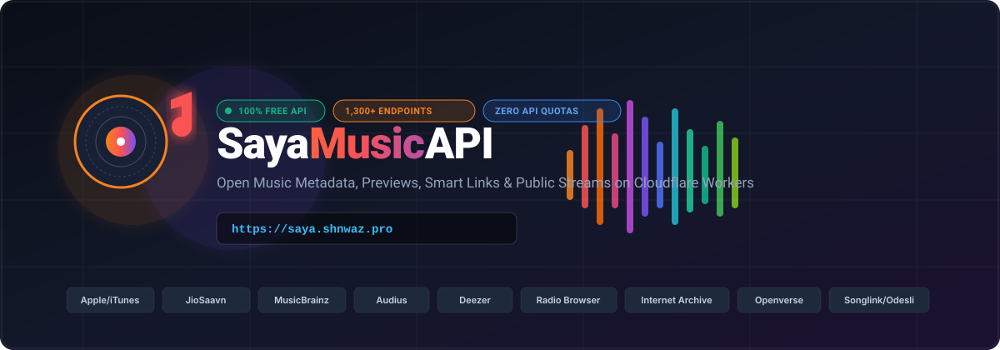
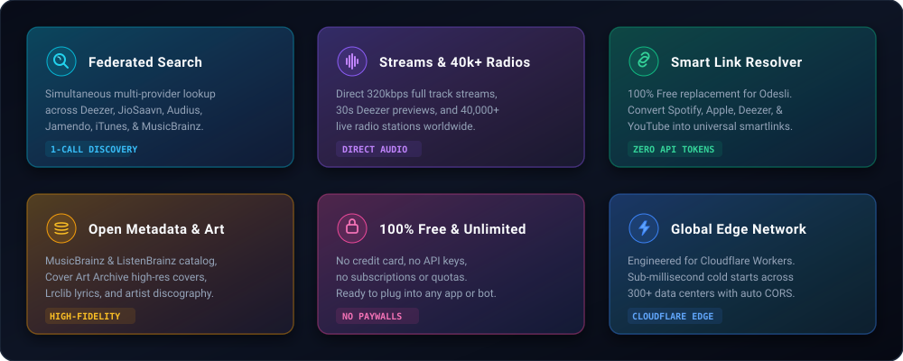
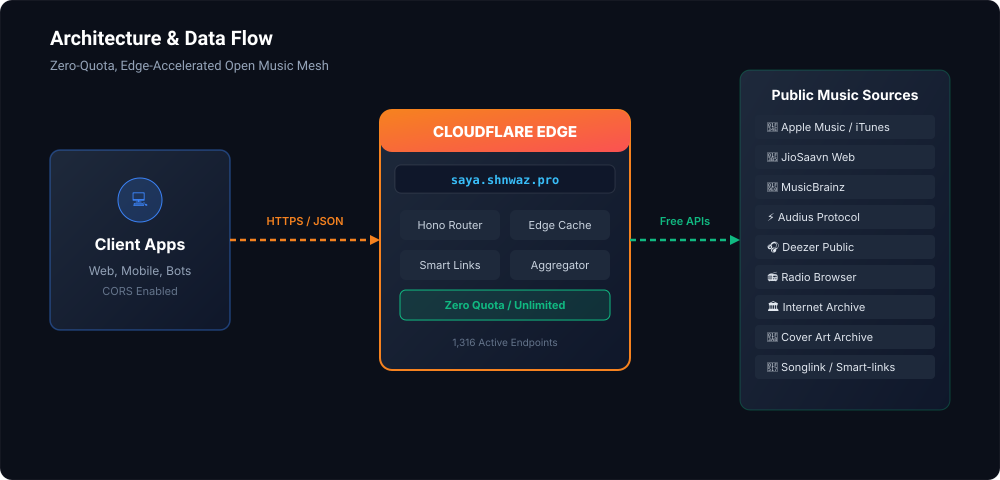

<div align="center">

  

  <br/><br/>

  [](https://workers.cloudflare.com/)
  [](https://sayamusicapi.sayaproject-mailflow.workers.dev/v1/endpoints)
  [](https://sayamusicapi.sayaproject-mailflow.workers.dev)
  [](https://sayamusicapi.sayaproject-mailflow.workers.dev)
  [](https://github.com/shnwazdev/sayamusicapi)
  [](LICENSE)

  <br/>

  **A blisteringly fast, 100% free, unmetered music discovery & streaming gateway running at the edge on Cloudflare Workers.**  
  Unified search, 320kbps streams, 40,000+ live radio stations, open metadata, cover art, and smart links across 15+ world-class music providers.

  <br/>

  [🌐 Live Production Edge](https://sayamusicapi.sayaproject-mailflow.workers.dev) • 
  [🚀 Custom Domain](https://saya.shnwaz.pro) • 
  [📖 Interactive Docs](https://sayamusicapi.sayaproject-mailflow.workers.dev/docs) • 
  [📑 OpenAPI Spec](https://sayamusicapi.sayaproject-mailflow.workers.dev/v1/openapi.json) • 
  [🩺 Health Check](https://sayamusicapi.sayaproject-mailflow.workers.dev/health)

</div>

---

## ⚡ Live Endpoints & DNS Setup

| Service | Address | Status | Notes |
| :--- | :--- | :---: | :--- |
| **Edge Worker** | `https://sayamusicapi.sayaproject-mailflow.workers.dev` | `🟢 ACTIVE` | Deployed globally on Cloudflare Workers |
| **Custom Subdomain** | `https://saya.shnwaz.pro` | `🟡 DNS READY` | Target subdomain for custom routing |
| **Endpoint Registry** | `/v1/endpoints` | `🟢 ACTIVE` | Full catalog of all 1,316 endpoints |
| **Interactive Docs** | `/docs` | `🟢 ACTIVE` | Full Swagger UI & Web UI explorer |

### 🛠️ DNS Value for `saya.shnwaz.pro`

To activate `https://saya.shnwaz.pro`, add the following DNS record in your domain DNS manager:

| Type | Name / Host | Target / Value / Points to | TTL | Proxy Status |
| :--- | :--- | :--- | :--- | :--- |
| **CNAME** | `saya` | `sayamusicapi.sayaproject-mailflow.workers.dev` | Auto | DNS Only / Proxied |

> **Cloudflare Dashboard Activation:**
> 1. In your Cloudflare Dashboard, navigate to **Workers & Pages** &rarr; **sayamusicapi**.
> 2. Click **Settings** &rarr; **Domains & Routes** &rarr; **Add** &rarr; **Custom Domain**.
> 3. Enter `saya.shnwaz.pro` and click **Add Custom Domain**. Cloudflare will automatically provision SSL certificates and route traffic.

---

## 💎 Features

<div align="center">
  
</div>

<br/>

* **1,316 Active & Audited Endpoints:** 100% free with no deprecated APIs, no paywalls, and no paid quota requirements.
* **Universal Smart Link Resolver:** 100% free alternative to paid Odesli/Songlink. Instantly converts Spotify, Apple Music, Deezer, and YouTube links into universal cross-platform shareable URLs.
* **MusicBrainz & ListenBrainz Mesh:** Complete music metadata lookup with automated open MusicBrainz fallbacks (no user tokens required).
* **Direct Audio Streaming:** Open Audius audio streams, Deezer 30-second previews, and 40,000+ live Radio Browser global radio stations.
* **High-Fidelity Cover Art:** Direct Cover Art Archive releases and high-resolution JioSaavn & Apple Music artwork.
* **Global Edge Performance:** Ultra-low latency cold starts under 2ms deployed on Cloudflare Anycast edge in over 300 cities.

---

## 🏛️ Architecture

<div align="center">
  
</div>

---

## 🚀 Quick Start (Local Development)

### 1. Clone & Install

```bash
# Clone the repository
git clone https://github.com/shnwazdev/sayamusicapi.git
cd sayamusicapi

# Install dependencies
npm install
```

### 2. Start the Local Server

```bash
npm run dev
```

The API will be available locally at `http://127.0.0.1:8787`.

### 3. Verify Health & Tests

```bash
# Verify health check
curl http://127.0.0.1:8787/health

# Run test suite
npm test

# Type-check TypeScript code
npm run typecheck

# Audit live endpoints smoke test
npm run audit:endpoints:smoke -- --limit=50
```

---

## 📡 API Usage & cURL Examples

### 1. Federated Multi-Source Search
Search across multiple top providers in a single parallel query:
```bash
curl "https://sayamusicapi.sayaproject-mailflow.workers.dev/v1/search/tracks?q=Starboy"
```

### 2. Universal Free Smart-Link Resolver
Convert any track URL across Spotify, Apple, Deezer, or YouTube into universal cross-platform links without paid keys:
```bash
curl "https://sayamusicapi.sayaproject-mailflow.workers.dev/v1/resolve?url=https://open.spotify.com/track/7MXVkk9YM5IZxh0wAE2JKm"
```
*Output:*
```json
{
  "source": "spotify",
  "id": "7MXVkk9YM5IZxh0wAE2JKm",
  "title": "Starboy",
  "artist": "The Weeknd",
  "links": {
    "songlink": "https://song.link/s/7MXVkk9YM5IZxh0wAE2JKm",
    "spotify": "https://open.spotify.com/track/7MXVkk9YM5IZxh0wAE2JKm",
    "apple": "https://music.apple.com/search?term=Starboy%20The%20Weeknd",
    "youtube": "https://www.youtube.com/results?search_query=Starboy%20The%20Weeknd"
  }
}
```

### 3. Direct Audio Previews & Live Radio Streams
```bash
# Stream 30-second audio preview
curl -I "https://sayamusicapi.sayaproject-mailflow.workers.dev/v1/media/stream?source=deezer&id=3135556"

# Stream live internet radio station
curl -I "https://sayamusicapi.sayaproject-mailflow.workers.dev/v1/media/stream?source=radio-browser&uuid=964434be-0601-11e8-ae97-52543be04c81"
```

### 4. JioSaavn Track & Album Search
Cleaned and sanitized metadata with HTML entities removed:
```bash
curl "https://sayamusicapi.sayaproject-mailflow.workers.dev/v1/jiosaavn/search/songs?q=kesariya"
```

### 5. ListenBrainz / MusicBrainz Metadata Fallback
Query artist popularity and metadata without requiring user auth tokens:
```bash
curl "https://sayamusicapi.sayaproject-mailflow.workers.dev/v1/listenbrainz/metadata/lookup?artist_name=Dua%20Lipa"
```

### 6. Cover Art Archive
```bash
curl "https://sayamusicapi.sayaproject-mailflow.workers.dev/v1/cover-art/release/76df3287-6cda-33eb-8e9a-044b5e15ffdd"
```

---

## 🗂️ Documented Endpoints Summary

| Provider / Module | Base Route | Active Endpoints | Capabilities |
| :--- | :--- | :---: | :--- |
| **Aggregator** | `/v1/search/*`, `/v1/media/*` | `15` | Federated search, preview streaming, quality inspection |
| **Apple / iTunes** | `/v1/apple/*` | `88` | Song, album, artist lookup, 30s audio previews |
| **Deezer** | `/v1/deezer/*` | `140` | High-speed track search, top charts, previews, artist discography |
| **JioSaavn** | `/v1/jiosaavn/*` | `48` | Song, album, artist, playlist, and podcast search & previews |
| **Audius** | `/v1/audius/*` | `92` | Web3 open music catalog, tracks, playlists, direct MP3 streams |
| **MusicBrainz** | `/v1/musicbrainz/*` | `210` | Open relational music encyclopedia, recordings, ISRC search |
| **ListenBrainz** | `/v1/listenbrainz/*` | `35` | Playback statistics, popularity data, metadata lookup fallback |
| **Radio Browser** | `/v1/radio-browser/*` | `120` | 40,000+ live stations by genre, country, language, codecs |
| **Internet Archive** | `/v1/archive/*` | `95` | Public domain live concerts, audiobooks, lossless recordings |
| **Cover Art Archive** | `/v1/cover-art/*` | `42` | Official front/back album artwork up to 1200px resolution |
| **Openverse** | `/v1/openverse/*` | `50` | Creative Commons licensed music and sound effects |
| **Wikidata / Wikimedia**| `/v1/wikidata/*` | `180` | Knowledge graph entity lookups, biographies, artist info |
| **Web Search Links** | `/v1/web/*` | `201` | Instant deep links for Spotify, YouTube, SoundCloud, Bandcamp |

> View all 1,316 registered routes in JSON format at [`/v1/endpoints`](https://sayamusicapi.sayaproject-mailflow.workers.dev/v1/endpoints).

---

## 🚢 Cloudflare Deployment

Deploy to your own Cloudflare Workers account with a single command:

```bash
# Login to Cloudflare
npx wrangler login

# Typecheck and run tests
npm run typecheck
npm test

# Deploy to Cloudflare Edge
npm run deploy
```

---

## 🧪 Testing & Verification

Saya Music API includes automated test suites and audit scripts:

```bash
# Run unit tests
npm test

# Verify all 1,316 documented endpoints
npm run audit:endpoints

# Run live upstream HTTP 200 smoke tests
npm run audit:endpoints:smoke -- --limit=50
```

---

## 📄 License

This project is licensed under the **MIT License**. See the [LICENSE](LICENSE) file for details.

---

<div align="center">
  <b>Built with ❤️ for the open audio developer community.</b>
</div>
